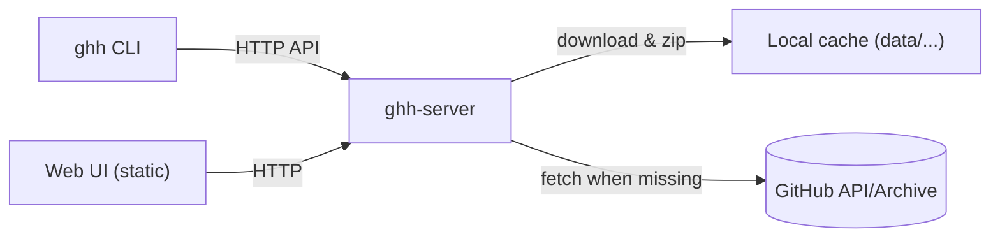
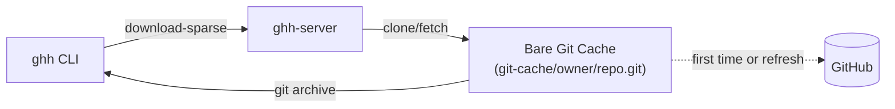
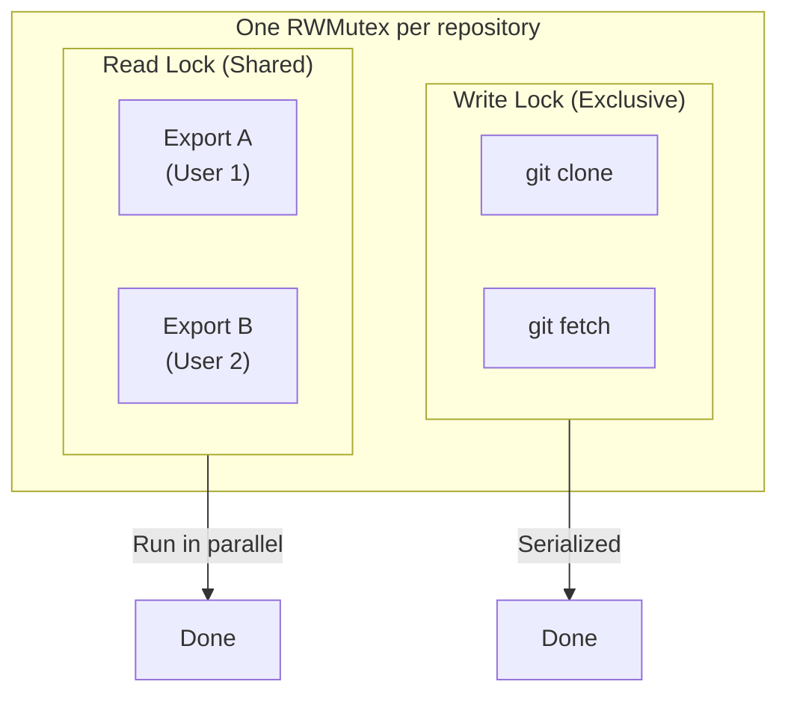
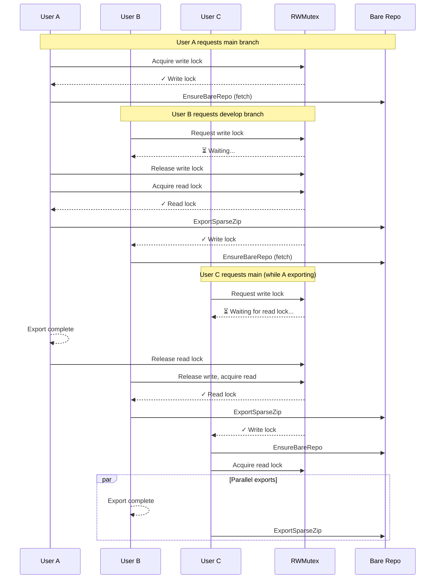

# github-hub
A hub to mirror and cache GitHub projects for environments without direct internet.

## Components
- Server (`ghh-server`): downloads repositories from GitHub and caches them on disk until explicitly deleted.
- Client (`ghh`): CLI to request downloads, switch branches, list and delete server-side directories.

## Architecture


## Quick start
1. Start server (default root `data/`):
   - Native:
     - `go build -o bin/ghh-server ./cmd/ghh-server`
     - `GITHUB_TOKEN=<optional> bin/ghh-server --addr :8080 --root data`
   - Docker:
     - `docker build -t ghh-server .`
     - `docker run -p 8080:8080 -v %CD%\\data:/data -e GITHUB_TOKEN=your_token ghh-server` (Windows PowerShell)
     - `docker run -p 8080:8080 -v $(pwd)/data:/data -e GITHUB_TOKEN=your_token ghh-server` (Linux/macOS)
2. Use client:
   - `go build -o bin/ghh ./cmd/ghh`
   - Download (creates/uses server cache). Provide `--user`/`GHH_USER` + `--token`/`GHH_TOKEN` to use client creds; otherwise the server defaults.
     - `bin/ghh --server http://localhost:8080 --user alice --token <PAT> download --repo owner/repo --branch main --dest out.zip`
     - `bin/ghh --server http://localhost:8080 download --repo owner/repo --branch main --dest ./code --extract`
   - **Sparse download** (download only specific directories):
     - `bin/ghh --server http://localhost:8080 download-sparse --repo owner/repo --branch main --path src --path docs --dest out.zip`
     - `bin/ghh --server http://localhost:8080 download-sparse --repo owner/repo --path src --dest ./code --extract`
   - Switch branch (ensures cache exists):
     - `bin/ghh --server http://localhost:8080 switch --repo owner/repo --branch dev`
   - List/delete server workspace (paths are relative to user root; server prefixes `users/<user>/` automatically):
     - `bin/ghh --server http://localhost:8080 ls --path repos/owner/repo`
     - `bin/ghh --server http://localhost:8080 rm --path repos/owner/repo --r`
- Check version: `bin/ghh --version` and `bin/ghh-server --version` print the packaged version so you can decide whether to upgrade (set via `-ldflags "-X github-hub/internal/version.Version=vX.Y.Z"` when building).

## Sparse Download (Git Archive)

The `download-sparse` command allows downloading only specific directories from a repository, which is useful for large repos where you only need a subset of the code.

### How it works



The server uses `git archive` to directly export specified paths from the bare repository to a zip file, which is much faster than the traditional worktree + sparse-checkout approach.

### Features

| Feature | Description |
|---------|-------------|
| **Shared bare repo cache** | Server maintains a bare Git repository per project, shared across all users and branches |
| **Incremental updates** | `git fetch` only downloads new commits, not the entire repo |
| **Multiple directories** | Use `--path` multiple times to include several directories |
| **Concurrent safety** | Read-write locks ensure safe concurrent access (multiple reads, exclusive writes) |
| **Commit tracking** | Response includes `X-GHH-Commit` header and `commit.txt` file with the commit SHA |

### Usage

```bash
# Download single directory
bin/ghh --server http://localhost:8080 download-sparse \
  --repo owner/repo \
  --branch main \
  --path src \
  --dest output.zip

# Download multiple directories and extract
bin/ghh --server http://localhost:8080 download-sparse \
  --repo owner/repo \
  --path src \
  --path docs \
  --path configs \
  --dest ./project \
  --extract

# Branch defaults to "main" if omitted
bin/ghh --server http://localhost:8080 download-sparse \
  --repo owner/repo \
  --path src \
  --dest output.zip
```

### Server requirements

- **Git** must be installed on the server (included in Docker image)
- Bare repos are cached at `<root>/git-cache/<owner>/<repo>.git`

### Concurrency Model & Locking Mechanism

The server uses **read-write locks (`sync.RWMutex`)** to ensure safe concurrent access for multiple users:



#### Lock Scope

| Operation | Lock Type | Behavior | Function |
|-----------|-----------|----------|----------|
| Clone/Update repo | **Write lock** | Exclusive access, blocks all other operations | `acquireGitCacheWrite()` |
| Export sparse content | **Read lock** | Allows multiple concurrent reads | `acquireGitCacheRead()` |

#### Lock Granularity

- **Per-repository isolation**: Each `owner/repo` has its own lock; different repos don't block each other
- **Key format**: `git-cache|owner/repo`

#### Concurrency Scenario Example



#### Safety Guarantees

1. **Write-write exclusion**: Clone/fetch operations on the same repo are serialized
2. **Read-write exclusion**: Exports wait during fetch; fetch waits for all reads to complete
3. **Read-read concurrency**: Multiple users can export different branches from the same repo simultaneously

Server keeps cached archives as zip files under `data/users/<user>/repos/<owner>/<repo>/<branch>.zip` until deleted via API (contents are not extracted on disk).
- Concurrency & cleanup: downloads are per-user and per-branch locked; artifacts are written via tmp dir + atomic rename. A background janitor runs every minute to delete repos idle for >24h.

Client configuration (optional): copy `configs/config.example.yaml` to `configs/config.yaml`, then pass `--config configs/config.yaml` or set `GHH_CONFIG`.
- Fields: `base_url` (server URL), `token` (auth), `user` (cache grouping/user name).

Server configuration (optional): copy `configs/server.config.example.yaml` to `configs/server.config.yaml` and pass `--config` to `ghh-server` if needed.
- Fields: `addr` (listen), `root` (workspace path), `default_user` (used when client omits user), `token` (server-side GitHub token, env `GITHUB_TOKEN` also supported).

## Web UI
- Open `http://localhost:8080/` to browse cached zip files with a lightweight static UI (no preview of zip contents).
- Uses `/api/v1/dir/list` to navigate folders, starting from the current user's workspace (server prefixes `users/<user>/` under the hood).
- Entries are zip files named `<branch>.zip`; client-side filtering by name/path supported.
- Delete actions call `DELETE /api/v1/dir?path=...&recursive=<bool>`; directories are removed recursively when `recursive=true`. The list refreshes after deletion.

## Additional docs
- 中文文档：see `README.zh.md`.
- 应用使用说明：see `README.app.md`.
- Server config example: `configs/server.config.example.yaml`.
