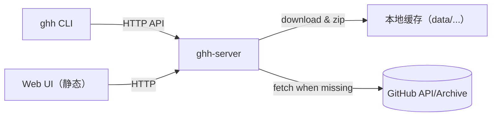

# github-hub（中文）
用于在无法直连互联网的环境中镜像、缓存 GitHub 仓库的轻量服务与客户端。

## 组件
- 服务端（`ghh-server`）：从 GitHub 下载仓库并缓存在本地，直到显式删除。
- 客户端（`ghh`）：命令行工具，用于请求下载、切换分支、列出和删除服务端目录。

## 架构

## 快速开始
1. 启动服务端（默认根目录 `data/`）  
   - 原生：
     - `go build -o bin/ghh-server ./cmd/ghh-server`
     - `GITHUB_TOKEN=<可选> bin/ghh-server --addr :8080 --root data`
   - Docker：
     - `docker build -t ghh-server .`
     - `docker run -p 8080:8080 -v %CD%\\data:/data -e GITHUB_TOKEN=your_token ghh-server`（Windows PowerShell）
     - `docker run -p 8080:8080 -v $(pwd)/data:/data -e GITHUB_TOKEN=your_token ghh-server`（Linux/macOS）
2. 使用客户端：
   - `go build -o bin/ghh ./cmd/ghh`
   - 下载（创建/复用服务端缓存）。如需使用客户端凭证，传 `--user`/`GHH_USER` 和 `--token`/`GHH_TOKEN`；否则使用服务端默认配置。
     - `bin/ghh --server http://localhost:8080 --user alice --token <PAT> download --repo owner/repo --branch main --dest out.zip`
     - `bin/ghh --server http://localhost:8080 download --repo owner/repo --branch main --dest ./code --extract`
   - 切换分支（确保缓存存在）：
     - `bin/ghh --server http://localhost:8080 switch --repo owner/repo --branch dev`
   - 列出/删除服务端目录（路径相对用户根，服务端会自动加前缀 `users/<user>/`）：
     - `bin/ghh --server http://localhost:8080 ls --path repos/owner/repo`
     - `bin/ghh --server http://localhost:8080 rm --path repos/owner/repo --r`

仓库默认缓存在 `data/users/<user>/repos/<owner>/<repo>/<branch>`，通过 API 删除后才会清理。
- 并发与清理：同一用户同一仓库/分支下载会加锁，先解压到临时目录再原子替换；后台协程每分钟清理一次，超过 24 小时未访问的仓库会被删除。

## 配置
从 `configs/config.example.yaml` 复制到 `configs/config.yaml`，再通过 `--config` 或环境变量 `GHH_CONFIG` 加载。
- 字段说明：`base_url`（服务端地址）、`token`（鉴权）、`user`（用户/分组名称）。`endpoints` 可留空，除非自定义代理改了路径。

服务端配置（可选）：从 `configs/server.config.example.yaml` 复制为 `configs/server.config.yaml`，通过 `ghh-server --config` 指定。
- 字段：`addr`（监听）、`root`（工作区）、`default_user`（客户端未传用户时使用）、`token`（服务端默认 GitHub token，`GITHUB_TOKEN` 也支持）。

## Web UI
- 访问 `http://localhost:8080/`，使用静态页面浏览已缓存的工作区。
- 基于 `/api/v1/dir/list` 列出目录，默认从用户前缀下的路径开始，可下钻/返回查看大小和路径，并支持本地过滤。
- 删除调用 `DELETE /api/v1/dir?path=...&recursive=<bool>`；当 `recursive=true` 时目录递归删除，完成后自动刷新列表。

## 开发与测试
- 构建：`go build -o bin/ghh ./cmd/ghh`，`go build -o bin/ghh-server ./cmd/ghh-server`
- 测试：`go test ./... -race -cover`
- 代码检查：`go vet ./...`（如配置 `golangci-lint`，执行 `golangci-lint run`）

## 相关文档
- 英文 README：`README.md`
- 应用使用说明：`README.app.md`
- 服务端配置示例：`configs/server.config.example.yaml`
