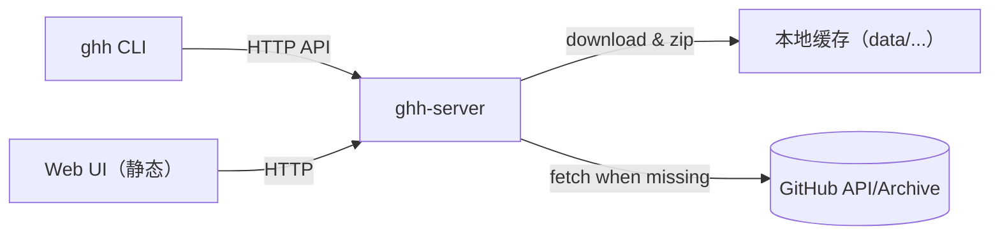
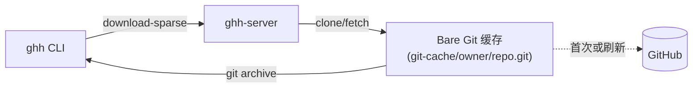
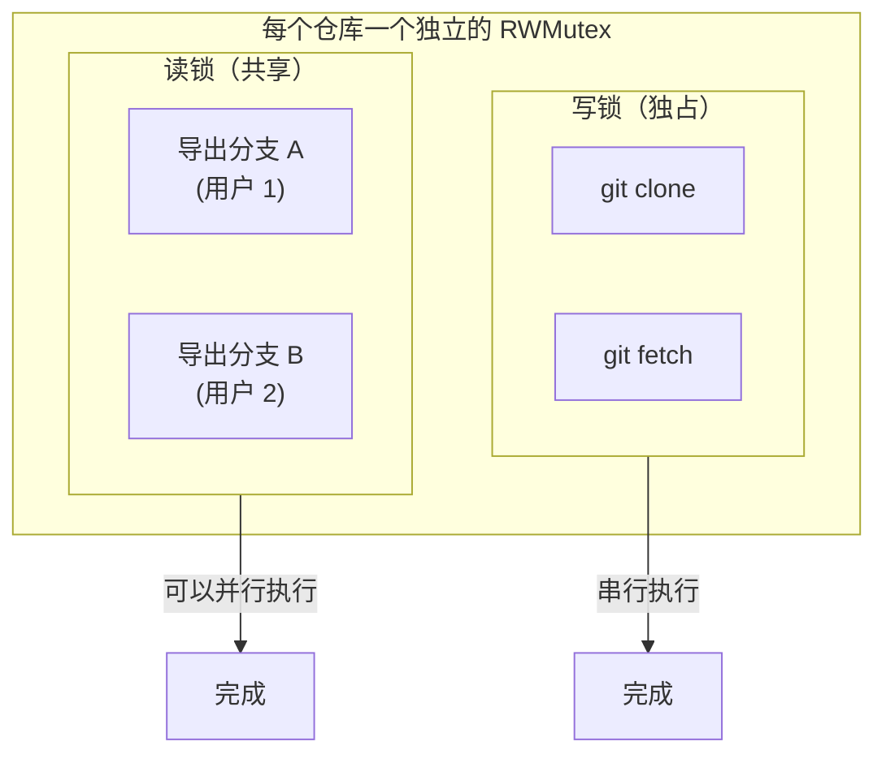
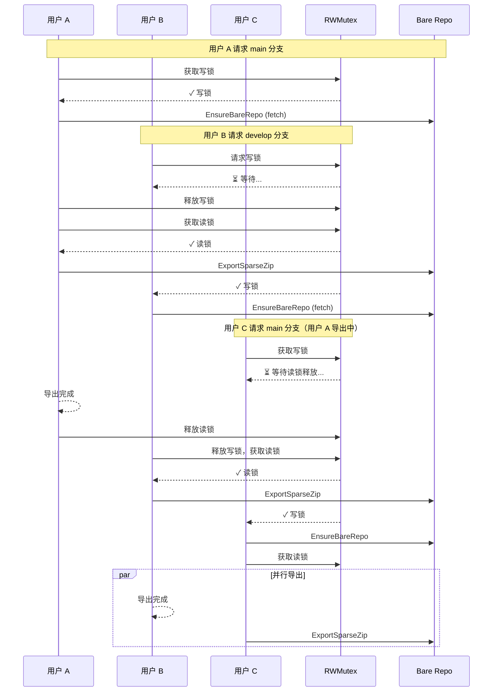

# github-hub（中文）
用于在无法直连互联网的环境中镜像、缓存 GitHub 仓库的轻量服务与客户端。

## 组件
- 服务端（`ghh-server`）：从 GitHub 下载仓库并以 zip 缓存在本地，直到显式删除。
- 客户端（`ghh`）：命令行工具，用于请求下载、切换分支、列出和删除服务端目录。

## 架构


## 快速开始
1. 启动服务端（默认根目录 `data/`）  
   - 原生：`go build -o bin/ghh-server ./cmd/ghh-server`，`GITHUB_TOKEN=<可选> bin/ghh-server --addr :8080 --root data`
   - Docker：`docker build -t ghh-server .`  
     - Windows：`docker run -p 8080:8080 -v %CD%\\data:/data -e GITHUB_TOKEN=your_token ghh-server`  
     - Linux/macOS：`docker run -p 8080:8080 -v $(pwd)/data:/data -e GITHUB_TOKEN=your_token ghh-server`
2. 使用客户端：`go build -o bin/ghh ./cmd/ghh`
   - 下载（仅缓存 zip，不解压到磁盘）：  
     - `bin/ghh --server http://localhost:8080 --user alice --token <PAT> download --repo owner/repo --branch main --dest out.zip`
     - `bin/ghh --server http://localhost:8080 download --repo owner/repo --branch main --dest ./code --extract`
   - **稀疏下载**（仅下载指定目录）：
     - `bin/ghh --server http://localhost:8080 download-sparse --repo owner/repo --branch main --path src --path docs --dest out.zip`
     - `bin/ghh --server http://localhost:8080 download-sparse --repo owner/repo --path src --dest ./code --extract`
   - 切换分支：`bin/ghh --server http://localhost:8080 switch --repo owner/repo --branch dev`
   - 列出/删除（路径相对用户根，服务端自动加前缀 `users/<user>/`）：  
     - `bin/ghh --server http://localhost:8080 ls --path repos/owner/repo`
     - `bin/ghh --server http://localhost:8080 rm --path repos/owner/repo --r`
- 查看版本：`bin/ghh --version` 与 `bin/ghh-server --version` 会输出当前打包版本，便于判断是否需要升级（构建时可通过 `-ldflags "-X github-hub/internal/version.Version=vX.Y.Z"` 设置）。

仓库以 zip 缓存在 `data/users/<user>/repos/<owner>/<repo>/<branch>.zip`，不解压到磁盘；后台协程每分钟清理一次，超过 24 小时未访问的 zip 会被删除。

## 稀疏下载（Git Archive）

`download-sparse` 命令支持仅下载仓库中的指定目录，适用于大型仓库只需要部分代码的场景。

### 工作原理



服务端使用 `git archive` 直接从 bare 仓库导出指定路径到 zip 文件，比传统的 worktree + sparse-checkout 方式快得多。

### 特性

| 特性 | 说明 |
|------|------|
| **共享 Bare Repo 缓存** | 服务端为每个项目维护一个 bare Git 仓库，所有用户和分支共享 |
| **增量更新** | `git fetch` 只下载新提交，不重复下载整个仓库 |
| **多目录支持** | 使用多个 `--path` 参数可同时下载多个目录 |
| **并发安全** | 读写锁机制确保安全的并发访问（多读单写） |
| **提交追踪** | 响应包含 `X-GHH-Commit` 头和 `commit.txt` 文件，记录提交 SHA |

### 使用方法

```bash
# 下载单个目录
bin/ghh --server http://localhost:8080 download-sparse \
  --repo owner/repo \
  --branch main \
  --path src \
  --dest output.zip

# 下载多个目录并解压
bin/ghh --server http://localhost:8080 download-sparse \
  --repo owner/repo \
  --path src \
  --path docs \
  --path configs \
  --dest ./project \
  --extract

# 不指定分支时默认使用 main
bin/ghh --server http://localhost:8080 download-sparse \
  --repo owner/repo \
  --path src \
  --dest output.zip
```

### 服务端要求

- 服务器**必须安装 Git**（Docker 镜像已包含）
- Bare 仓库缓存位置：`<root>/git-cache/<owner>/<repo>.git`

### 并发模型与锁机制

服务端使用 **读写锁（`sync.RWMutex`）** 来保证多用户并发访问的安全性：



#### 锁的作用范围

| 操作 | 锁类型 | 行为 | 函数 |
|------|--------|------|------|
| 克隆/更新仓库 | **写锁** | 独占访问，阻塞其他读写 | `acquireGitCacheWrite()` |
| 导出稀疏内容 | **读锁** | 允许多个并发读取 | `acquireGitCacheRead()` |

#### 锁的粒度

- **按仓库隔离**：每个 `owner/repo` 有独立的锁，不同仓库的操作互不影响
- **键值格式**：`git-cache|owner/repo`

#### 并发场景示例



#### 保证的安全性

1. **写写互斥**：同一仓库的 clone/fetch 操作串行执行
2. **读写互斥**：fetch 进行时，导出操作等待；导出进行时，fetch 等待所有读完成
3. **读读并发**：多个用户可同时导出同一仓库的不同分支

## 配置
- 客户端：从 `configs/config.example.yaml` 复制到 `configs/config.yaml`，通过 `--config` 或 `GHH_CONFIG` 加载。字段：`base_url`、`token`、`user`。
- 服务端：从 `configs/server.config.example.yaml` 复制为 `configs/server.config.yaml`，通过 `ghh-server --config` 指定。字段：`addr`、`root`、`default_user`、`token`（或环境变量 `GITHUB_TOKEN`）。

## Web UI
- 访问 `http://localhost:8080/`，仅浏览缓存的 zip 文件（不预览 zip 内部内容）。
- 基于 `/api/v1/dir/list` 列出目录，默认从用户前缀开始，条目为 `<branch>.zip`，支持本地过滤。
- 删除调用 `DELETE /api/v1/dir?path=...&recursive=<bool>`；当 `recursive=true` 时递归删除目录，完成后自动刷新列表。

## 开发与测试
- 构建：`go build -o bin/ghh ./cmd/ghh`，`go build -o bin/ghh-server ./cmd/ghh-server`
- 测试：`go test ./... -race -cover`
- 代码检查：`go vet ./...`（如配置 `golangci-lint`，执行 `golangci-lint run`）

## 相关文档
- 英文 README：`README.md`
- 应用指南：`README.app.md`
- 服务端配置示例：`configs/server.config.example.yaml`
