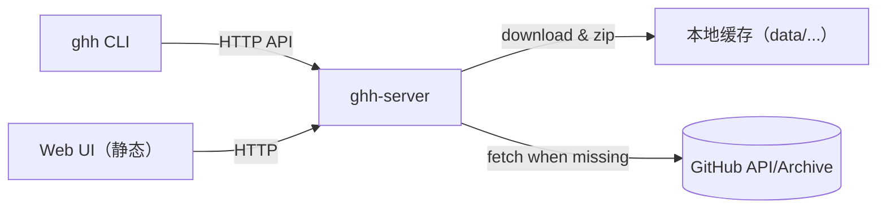

# github-hub（中文）
用于在无法直连互联网的环境中镜像、缓存 GitHub 仓库的轻量服务与客户端。

## 组件
- 服务端（`ghh-server`）：从 GitHub 下载仓库并以 zip 缓存在本地，直到显式删除。
- 客户端（`ghh`）：命令行工具，用于请求下载、切换分支、列出和删除服务端目录。

## 架构

## 快速开始
1. 启动服务端（默认根目录 `data/`）  
   - 原生：`go build -o bin/ghh-server ./cmd/ghh-server`，`GITHUB_TOKEN=<可选> bin/ghh-server --addr :8080 --root data`
   - Docker：`docker build -t ghh-server .`  
     - Windows：`docker run -p 8080:8080 -v %CD%\\data:/data -e GITHUB_TOKEN=your_token ghh-server`  
     - Linux/macOS：`docker run -p 8080:8080 -v $(pwd)/data:/data -e GITHUB_TOKEN=your_token ghh-server`
2. 使用客户端：`go build -o bin/ghh ./cmd/ghh`
   - 下载（仅缓存 zip，不解压到磁盘）：  
     - `bin/ghh --server http://localhost:8080 --user alice --token <PAT> download --repo owner/repo --branch main --dest out.zip`
     - `bin/ghh --server http://localhost:8080 download --repo owner/repo --branch main --dest ./code --extract`
   - 切换分支：`bin/ghh --server http://localhost:8080 switch --repo owner/repo --branch dev`
   - 列出/删除（路径相对用户根，服务端自动加前缀 `users/<user>/`）：  
     - `bin/ghh --server http://localhost:8080 ls --path repos/owner/repo`
     - `bin/ghh --server http://localhost:8080 rm --path repos/owner/repo --r`
- 查看版本：`bin/ghh --version` 与 `bin/ghh-server --version` 会输出当前打包版本，便于判断是否需要升级（构建时可通过 `-ldflags "-X github-hub/internal/version.Version=vX.Y.Z"` 设置）。

仓库以 zip 缓存在 `data/users/<user>/repos/<owner>/<repo>/<branch>.zip`，不解压到磁盘；后台协程每分钟清理一次，超过 24 小时未访问的 zip 会被删除。

## 配置
- 客户端：从 `configs/config.example.yaml` 复制到 `configs/config.yaml`，通过 `--config` 或 `GHH_CONFIG` 加载。字段：`base_url`、`token`、`user`。
- 服务端：从 `configs/server.config.example.yaml` 复制为 `configs/server.config.yaml`，通过 `ghh-server --config` 指定。字段：`addr`、`root`、`default_user`、`token`（或环境变量 `GITHUB_TOKEN`）。

## Web UI
- 访问 `http://localhost:8080/`，仅浏览缓存的 zip 文件（不预览 zip 内部内容）。
- 基于 `/api/v1/dir/list` 列出目录，默认从用户前缀开始，条目为 `<branch>.zip`，支持本地过滤。
- 删除调用 `DELETE /api/v1/dir?path=...&recursive=<bool>`；当 `recursive=true` 时递归删除目录，完成后自动刷新列表。

## 开发与测试
- 构建：`go build -o bin/ghh ./cmd/ghh`，`go build -o bin/ghh-server ./cmd/ghh-server`
- 测试：`go test ./... -race -cover`
- 代码检查：`go vet ./...`（如配置 `golangci-lint`，执行 `golangci-lint run`）

## 相关文档
- 英文 README：`README.md`
- 应用指南：`README.app.md`
- 服务端配置示例：`configs/server.config.example.yaml`
